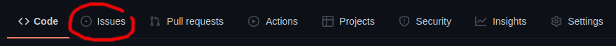

# [GEEM lab group](https://geem-ufsc.org/) seminars

## How to add a new seminar

1. Go to [issues](https://github.com/geem-lab/seminars/issues).
   
2. Open a [new issue](https://github.com/geem-lab/seminars/issues/new/choose).
   
3. Choose ["Seminar proposal"][proposal-template].
   
4. Follow the instructions and tick the boxes.

[proposal-template]: https://github.com/geem-lab/seminars/issues/new?assignees=&labels=seminar&template=seminar-proposal.md&title=%5BSEMINAR%5D+

## Useful resources

- [Basic formatting syntax on GitHub (Markdown)](https://docs.github.com/en/get-started/writing-on-github/getting-started-with-writing-and-formatting-on-github/basic-writing-and-formatting-syntax)
